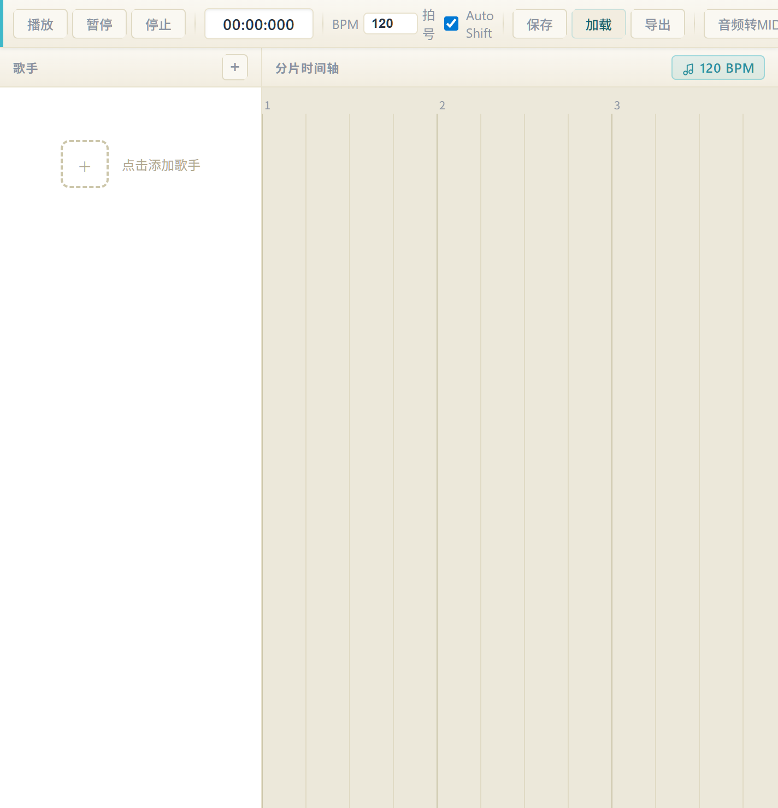
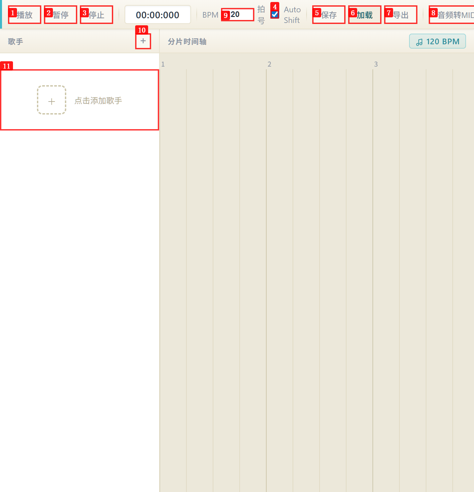
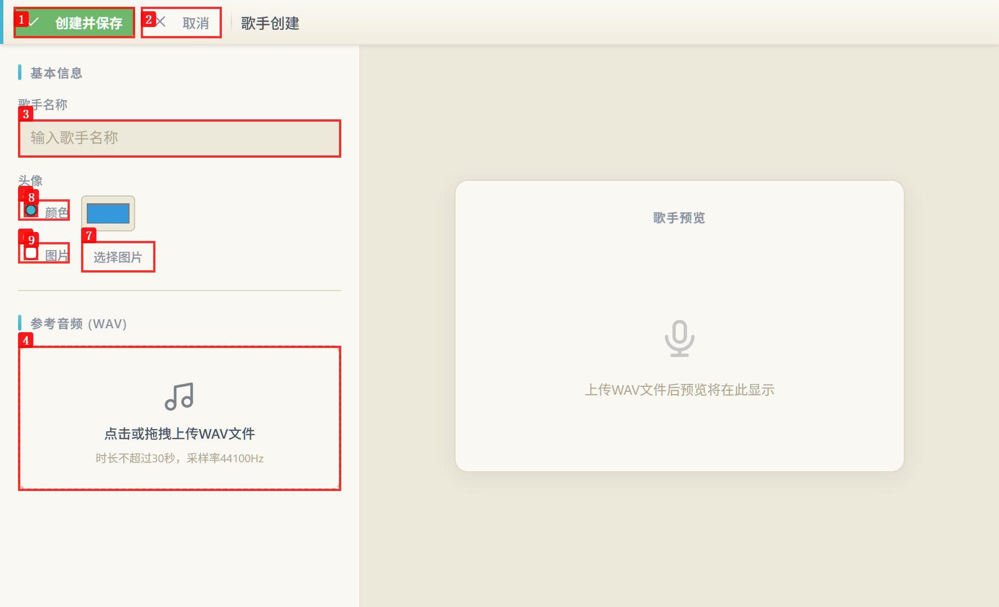
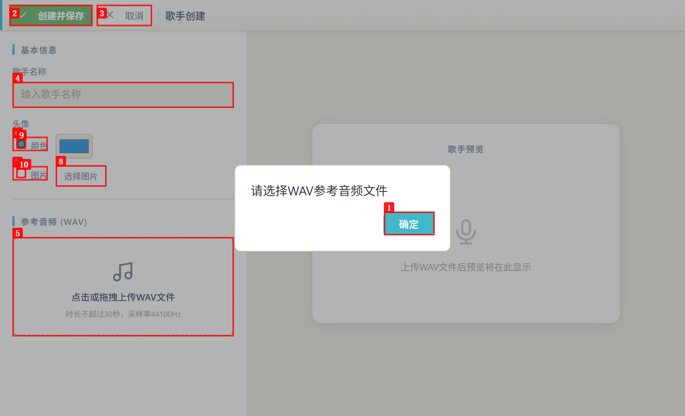
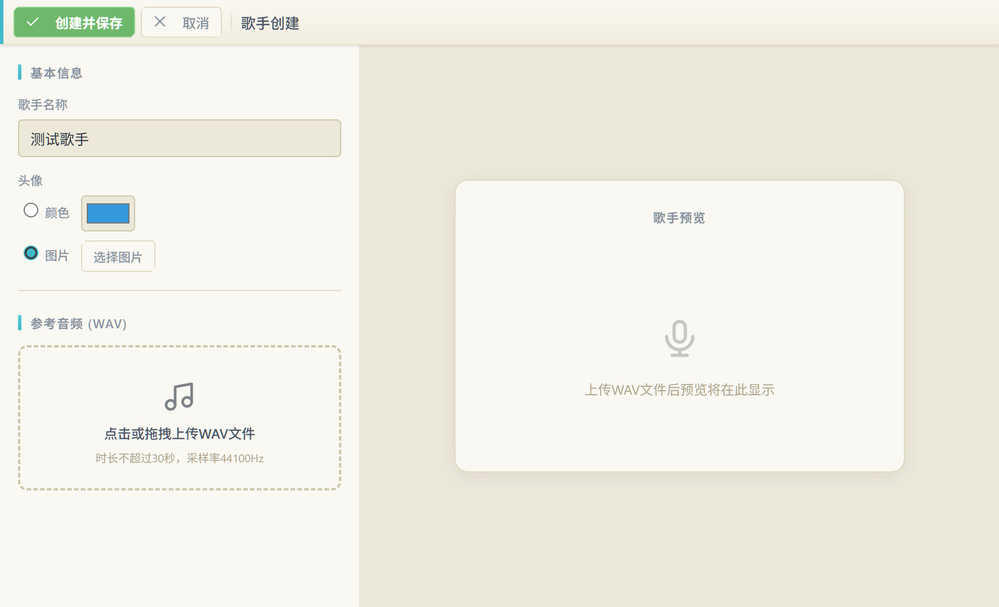
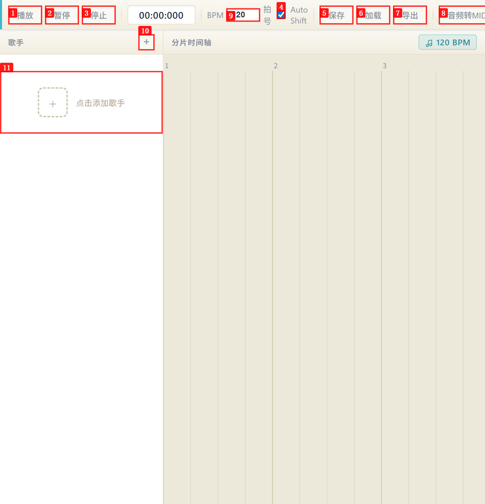

# Dogfood Report: SXSEditor (Electron app via CDP :9223)

| Field | Value |
|-------|-------|
| **Date** | 2026-07-01 |
| **App URL** | http://localhost:3000/main_window/index.html (Electron renderer, CDP port 9223) |
| **Session** | sxseditor |
| **Scope** | Full app, no authentication |

## Summary

| Severity | Count |
|----------|-------|
| Critical | 1 |
| High | 3 |
| Medium | 2 |
| Low | 1 |
| **Total** | **7** |

## Issues

### ISSUE-001: "加载"按钮点击无任何反应（功能失效）

| Field | Value |
|-------|-------|
| **Severity** | critical |
| **Category** | functional |
| **URL** | http://localhost:3000/main_window/index.html |
| **Repro Video** | N/A (CDP connect mode does not support video recording) |

**Description**

主界面顶部工具栏的"加载"按钮点击后完全无反应：不弹出文件选择对话框、不显示任何提示、控制台无错误输出、UI 状态无变化。连续点击两次行为一致。这导致用户无法加载已有项目文件，核心工作流被阻断。期望：点击后应弹出文件选择对话框让用户选择 `.sxs` 项目文件加载。

**Repro Steps**

1. 启动应用进入主界面（空状态）
   

2. 点击工具栏"加载"按钮
   

3. 再次点击"加载"按钮（等待 2 秒后）
   

4. **Observe:** 无文件对话框弹出，无提示信息，控制台无错误，UI 无变化 —— 按钮如同死链接。

---

### ISSUE-002: BPM 输入框接受负值和超大值，无边界验证

| Field | Value |
|-------|-------|
| **Severity** | high |
| **Category** | functional |
| **URL** | http://localhost:3000/main_window/index.html |
| **Repro Video** | N/A |

**Description**

BPM spinbutton 输入框没有最小/最大值验证：可以输入 `-5`（负数 BPM 无意义）和 `99999`（远超合理范围）。BPM 是音乐节拍核心参数，负值或极端值会导致时间轴计算、MIDI 时长分配等下游逻辑出错。期望：BPM 应限制在合理范围（如 20–400），并在失焦/回车时自动钳制到合法区间。

**Repro Steps**

1. 主界面 BPM 默认显示 120
   

2. 点击 BPM 输入框，Ctrl+A 全选后输入 `-5` 并按 Tab 失焦
   

3. 再输入 `99999` —— 同样被接受
   

4. **Observe:** 输入框显示 `-5` 和 `99999` 均被接受，无钳制、无警告。

---

### ISSUE-003: BPM 输入值与时间轴显示的 BPM 不同步

| Field | Value |
|-------|-------|
| **Severity** | high |
| **Category** | functional |
| **URL** | http://localhost:3000/main_window/index.html |
| **Repro Video** | N/A |

**Description**

修改顶部 BPM 输入框的值后，下方"分片时间轴"区域标题仍显示旧的 BPM 值。例如 BPM 改为 `-5` 或 `99999` 后，时间轴标题始终显示"120 BPM"，二者不一致。这会误导用户对当前节拍状态的判断。期望：BPM 输入变化后，时间轴标题应同步更新。

**Repro Steps**

1. BPM 输入 `-5`，时间轴仍显示 "120 BPM"
   

2. BPM 输入 `99999`，时间轴仍显示 "120 BPM"
   

3. **Observe:** 输入框值与时间轴显示的 BPM 永远不一致（时间轴似乎只在初始化时读取一次）。

---

### ISSUE-004: 歌手创建页面"图片"头像模式验证缺失

| Field | Value |
|-------|-------|
| **Severity** | high |
| **Category** | functional |
| **URL** | http://localhost:3000/main_window/index.html (歌手创建页面) |
| **Repro Video** | N/A |

**Description**

在歌手创建页面，将头像模式从"颜色"切换到"图片"后，若未选择任何图片就直接点"创建并保存"，验证只提示"请选择WAV参考音频文件"，**没有提示图片未选择**。即使用户选了图片模式但没传图片，验证逻辑也只检查 WAV 文件。期望：图片模式下应校验图片是否已选择。

**Repro Steps**

1. 进入歌手创建页面，填写歌手名称"测试歌手"
   

2. 点击"图片"单选按钮切换头像模式（此时未选任何图片）
   

3. 点击"创建并保存"
   

4. **Observe:** 仅提示"请选择WAV参考音频文件"，未提示图片缺失。另外，切换到图片模式后颜色选择器（ColorWell #3498db）仍可见，未隐藏。

---

### ISSUE-005: 验证弹窗存在时，"取消"按钮被弹窗拦截无法关闭页面

| Field | Value |
|-------|-------|
| **Severity** | medium |
| **Category** | ux |
| **URL** | http://localhost:3000/main_window/index.html (歌手创建页面) |
| **Repro Video** | N/A |

**Description**

在歌手创建页面，当点击"创建并保存"触发验证弹窗（如"请选择WAV参考音频文件"）后，弹窗底部的"取消"按钮和页面的"取消"按钮都无法工作 —— 必须先点弹窗的"确定"关闭弹窗，才能操作页面其他按钮。弹窗似乎以模态方式拦截了所有点击，但"取消"按钮在视觉上仍可点击，造成用户困惑。期望：弹窗存在时应明确禁用或遮罩背景按钮，或让"取消"也能直接关闭整个创建页面。

**Repro Steps**

1. 歌手创建页面，不填名称不选 WAV，点击"创建并保存" → 弹出"请选择WAV参考音频文件"
   

2. 点击弹窗外的页面"取消"按钮 → 无反应
   

3. **Observe:** 弹窗存在期间，页面"取消"按钮和"创建并保存"按钮均无响应，只有弹窗"确定"可关闭弹窗。

---

### ISSUE-006: "拍号"标签后无实际值显示

| Field | Value |
|-------|-------|
| **Severity** | medium |
| **Category** | content |
| **URL** | http://localhost:3000/main_window/index.html |
| **Repro Video** | N/A |

**Description**

主界面工具栏有"拍号"标签，但标签后面没有任何数值或下拉框（LabelText 节点后为空）。用户无法看到当前拍号（如 4/4、3/4），也无法修改它。BPM 旁边有可编辑的 spinbutton，但拍号既无显示也无控件。期望：拍号应显示当前值（如"4/4"）并提供修改入口，或若暂不支持则移除该标签。

**Repro Steps**

1. 主界面初始加载
   

2. **Observe:** "拍号"标签后为空白，无数值、无控件。

---

### ISSUE-007: Electron CSP 安全警告（unsafe-eval）

| Field | Value |
|-------|-------|
| **Severity** | low |
| **Category** | console |
| **URL** | http://localhost:3000/main_window/index.html |
| **Repro Video** | N/A |

**Description**

控制台持续输出 Electron Security Warning：渲染进程没有设置 Content-Security-Policy 或启用了 "unsafe-eval"。虽然提示"打包后不会显示"，但在开发阶段暴露 XSS 风险，且若打包配置遗漏可能带入生产。期望：开发阶段也应配置合理的 CSP，移除 unsafe-eval 依赖。

**Repro Steps**

1. 加载主界面，查看控制台
   

2. **Observe:** 控制台警告："This renderer process has either no Content Security Policy set or a policy with 'unsafe-eval' enabled."

---
